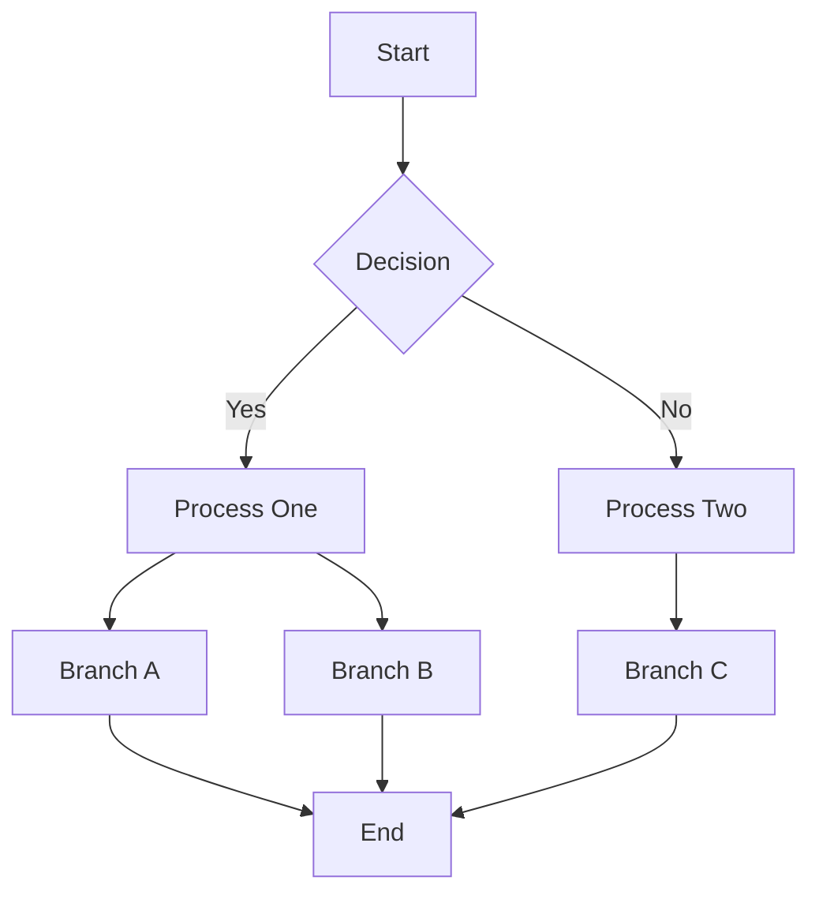

# Comprehensive Markdown Test Document (Updated)

This document tests all supported markdown extensions.
Updated with additional content in version 2.

## Text Formatting

This is **bold text** and this is _italic text_.
You can also use ~~strikethrough~~ and `inline code`.
Use ==highlighted text== for emphasis.
Added **new bold text** in version 2.

## Lists

### Unordered List

- Item 1
- Item 2 (modified)
- Item 3
- Item 4 (new)

### Ordered List

1. First item
2. Second item (updated)
3. Third item
4. Fourth item (added)

### Task List

- [ ] Task 1
- [x] Task 2
- [x] Task 3

## Code Blocks

```javascript
function greet(name) {
  // Updated comment in v2
  console.log(`Hello, ${name}! Welcome!`);
}

function farewell(name) {
  console.log(`Goodbye, ${name}!`);
}
```

## Links and Images

[Visit GitHub](https://github.com)
[Visit VS Code Marketplace](https://marketplace.visualstudio.com)

## Blockquotes

> This is a blockquote.
> It can span multiple lines.
> Added a new line in version 2.

## Emoji

:smile: :rocket: :+1: :star: :heart:

---

## Math (KaTeX)

Inline math: $E = mc^2$ and $F = ma$

Block math:

$$
\int_{-\infty}^{\infty} e^{-x^2} dx = \sqrt{\pi}
$$

New equation added:

$$
\sum_{i=1}^{n} i = \frac{n(n+1)}{2}
$$

## Mermaid Diagrams



## GitHub Alerts

> [!NOTE]
> This is a note alert with updated content.

> [!WARNING]
> This is a warning alert.

> [!TIP]
> This is a new tip alert added in v2.

## Footnotes

This is a sentence with a footnote[^1].
And another sentence with a second footnote[^2].

[^1]: This is the footnote content (updated).

[^2]: This is a new footnote added in v2.

## Wikilinks

See [[Related Page]] for more information.
Also check [[New Page]] for recent updates.

## Subscript and Superscript

Water formula: H~2~O
Sulfuric acid: H~2~SO~4~
Einstein's equation: E = mc^2^
Quadratic: x^2^ + y^2^ = z^2^

## Definition Lists

Term 1
: Definition for term 1 (updated)

Term 2
: Definition for term 2

Term 3 (new)
: Definition for the new term

## Common Block (Folding Test)

MIT License

Copyright (c) 2026 Rich Markdown Diff Authors

Permission is hereby granted, free of charge, to any person obtaining a copy
of this software and associated documentation files (the "Software"), to deal
in the Software without restriction, including without limitation the rights
to use, copy, modify, merge, publish, distribute, sublicense, and/or sell
copies of the Software, and to permit persons to whom the Software is
furnished to do so, subject to the following conditions:

The above copyright notice and this permission notice shall be included in all
copies or substantial portions of the Software.

THE SOFTWARE IS PROVIDED "AS IS", WITHOUT WARRANTY OF ANY KIND, EXPRESS OR
IMPLIED, INCLUDING BUT NOT LIMITED TO THE WARRANTIES OF MERCHANTABILITY,
FITNESS FOR A PARTICULAR PURPOSE AND NONINFRINGEMENT. IN NO EVENT SHALL THE
AUTHORS OR COPYRIGHT HOLDERS BE LIABLE FOR ANY CLAIM, DAMAGES OR OTHER
LIABILITY, WHETHER IN AN ACTION OF CONTRACT, TORT OR OTHERWISE, ARISING FROM,
OUT OF OR IN CONNECTION WITH THE SOFTWARE OR THE USE OR OTHER DEALINGS IN THE
SOFTWARE.

## Image Test


## MDX and Custom Components

<Tabs>
  <TabItem value="npm" label="NPM" default>
    - Install package globally:
      ```bash
      npm install -g my-package
      ```
  </TabItem>
  <TabItem value="yarn" label="Yarn">
    - Install package:
      ```bash
      yarn add my-package
      ```
  </TabItem>
  <TabItem value="pnpm" label="PNPM">
    - Install package:
      ```bash
      pnpm add my-package
      ```
  </TabItem>
</Tabs>

Let's test inline badges: <Badge text="Warning" variant="warning" /> and <Badge text="Removed" variant="danger" />.

And here is a Starlight steps component:
<Steps>

1. Download the tool (new version)
2. Configure settings securely
3. Start running the process
   </Steps>

Here is a Starlight Card:

<Card title="Introduction" icon="note">
  Welcome to the premium card view, now with updated content.
</Card>

And a Docusaurus Admonition:
:::note Note Title
This is standard admonition text with updates in v2.
:::

:::danger Warning
Critical warning!
:::

And a custom unknown fallback element:

<CustomReactComponent user="alice" role="super-admin" theme="dark" />

## Summary

This is version 2 of the comprehensive test document with modifications.
